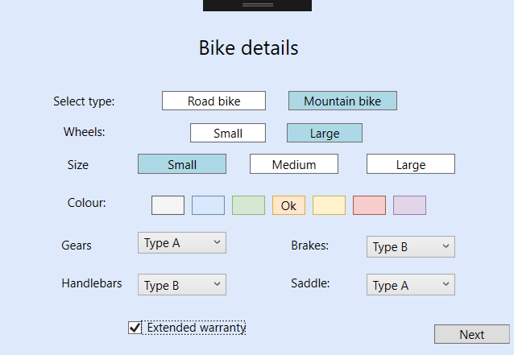
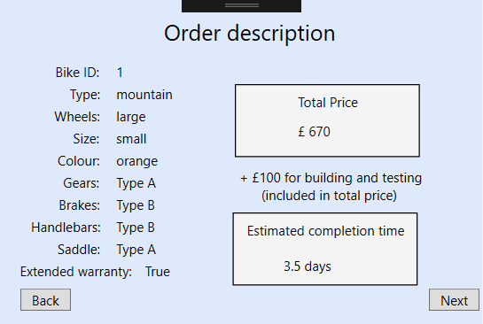
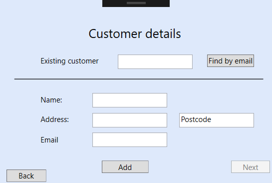
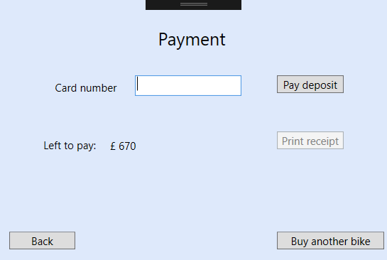

# Bike Shop System in C#

## Software Engineering Methods (SET08103)

### Edinburgh Napier University March 2018

Open in Visual Studio 2017

"Build-A-Bike" offers customers the ability to custom design and purchase their own Road Bike or Mountain Bike using a simple stage based system that lets them pick between standard and custom components

**Screenshots**

